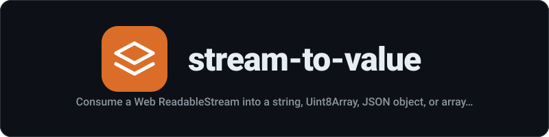

<div align="center">
  
</div>

<p align="center"><strong>Consume a Web ReadableStream into a string, Uint8Array, JSON object, or array of chunks</strong></p>

<p align="center">
  <a href="https://github.com/mstuart/stream-to-value/actions/workflows/main.yml"></a>
  <a href="LICENSE"></a>
  <a href="https://www.npmjs.com/package/stream-to-value"></a>
  
</p>

---
## Install

```sh
npm install stream-to-value
```

## Usage

```js
import {streamToString, streamToJson} from 'stream-to-value';

const response = await fetch('https://example.com/api');

const text = await streamToString(response.body);
console.log(text);

const response2 = await fetch('https://example.com/api/data');

const data = await streamToJson(response2.body);
console.log(data);
```

## API

### streamToString(readableStream)

Consume a `ReadableStream` into a string. Handles both string and `Uint8Array` chunks.

Returns a `Promise<string>`.

#### readableStream

Type: `ReadableStream`

The stream to consume.

### streamToUint8Array(readableStream)

Consume a `ReadableStream` into a single `Uint8Array`.

Returns a `Promise<Uint8Array>`.

#### readableStream

Type: `ReadableStream`

The stream to consume.

### streamToJson(readableStream)

Consume a `ReadableStream` and parse the content as JSON.

Returns a `Promise<unknown>`.

#### readableStream

Type: `ReadableStream`

The stream to consume.

### streamToArray(readableStream)

Consume a `ReadableStream` into an array of chunks.

Returns a `Promise<unknown[]>`.

#### readableStream

Type: `ReadableStream`

The stream to consume.

## Related

- [web-streams-polyfill](https://github.com/AshleySetter/web-streams-polyfill) - Web Streams API polyfill

## License

MIT
